# QCash: Quantum-Safe Private Vault on Solana


## What is QCash?

**QCash (Quantum-Safe Private Vault)** is a revolutionary private, anonymous, and post-quantum-secure value transfer system built on the Solana blockchain. 

### Why is this a "Big Thing" on Solana?

*   **Quantum Resistance:** Unlike most current blockchains that rely on Elliptic Curve Cryptography (which can be broken by future quantum computers), QCash uses **Post-Quantum Cryptography (Kyber-768)** and **STARKs**, ensuring your funds are safe decades into the future.
*   **Signature-Free Transactions:** Ownership and spending authority are proven via **Zero-Knowledge Proofs of Knowledge**, not digital signatures. Even if the underlying signature scheme of the blockchain were compromised, QCash assets would remain secure.
*   **Complete Privacy:** It leverages a UTXO-based model where the sender, receiver, and amount are cryptographically hidden.

---

## Setup & Installation

Follow these steps to get the project up and running.

### 1. Prerequisites
*   **Rust**: [Install Rust](https://rustup.rs/)
*   **Solana CLI**: [Install Solana CLI](https://docs.solanalabs.com/cli/install)
*   **Node.js (v18+) & npm**: [Install Node.js](https://nodejs.org/)
*   **Google Chrome**: Required for the wallet extension.

### 2. Build the Project
Compile the Rust daemon, methods, and extension.

```bash
# Build the daemon and smart contracts
cargo build --release --bin daemon

# Install the extension dependencies and build it
cargo xtask build-extension
```

### 3. Load the Extension
1.  Open Google Chrome and navigate to `chrome://extensions`.
2.  Enable **Developer mode** in the top right corner.
3.  Click **Load unpacked**.
4.  Select the `extension/dist` folder in your project directory.
5.  **Copy the Extension ID** (e.g., `beehfekainnbonhcmplhjahhjplfkgjo`). You will need this for the next step.

### 4. Configure Native Messaging (Crucial Step!)

The extension communicates with the locally running Rust daemon. You **MUST** ensure the paths are correct for your machine.

**A. Edit `com.qcash.daemon.json`**
Open this file in your root directory.
1.  **Allowed Origins:** Replace the ID in `"allowed_origins"` with the Extension ID you copied in step 3.
2.  **Path:** Ensure the `"path"` points to the `daemon_wrapper.sh` file in your project root.
    *   *Example:* `"/home/jayant/Desktop/bonsol/qcash/daemon_wrapper.sh"`

**B. Edit `daemon_wrapper.sh`**
Open this file in your root directory.
1.  **Project Root:** Update `PROJECT_ROOT` to match your actual project path.
    *   *Example:* `PROJECT_ROOT="/home/jayant/Desktop/bonsol/qcash"`
2.  **Home:** Update `export HOME` to your user's home directory.

**C. Install the Config**
Copy the config file to Chrome's Native Messaging folder:

```bash
# For Linux
mkdir -p ~/.config/google-chrome/NativeMessagingHosts/
cp com.qcash.daemon.json ~/.config/google-chrome/NativeMessagingHosts/
```

### 5. Start the Environment

Once everything is configured, start the full test environment (Validator, Node, Faucet):

```bash
cargo xtask start-test-env --show-node-logs
```

---

## How to Use QCash

Here is a step-by-step guide on how to use the wallet after the environment is running.

**1) Initial screen when you click on the extension icon**
(Click on the `Create New Wallet Button`)
<p align="center">
  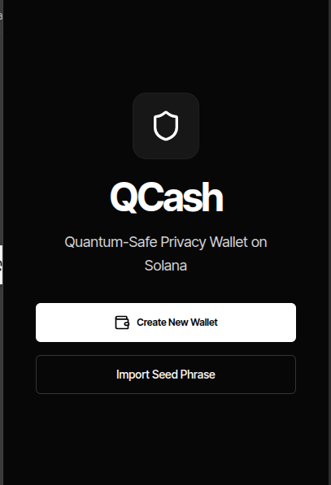
</p>

**2) Mnemonic Screen**
(Click on the continue button after saving the mnemonic)
<p align="center">
  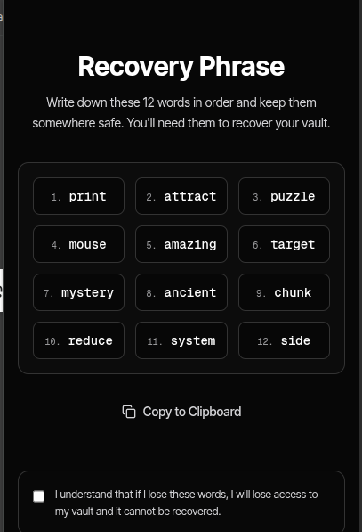
</p>

**3) You get your Solana and Kyber Public keys**
<p align="center">
  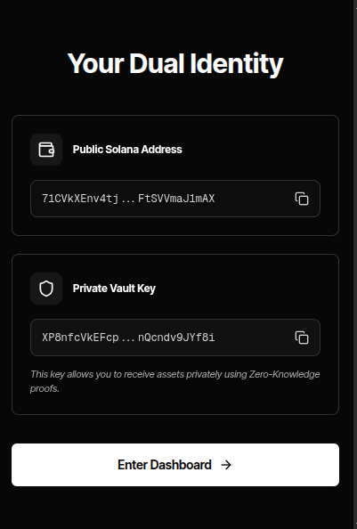
</p>

**4) The Dashboard**
(Click on the `Register On chain` button)
<p align="center">
  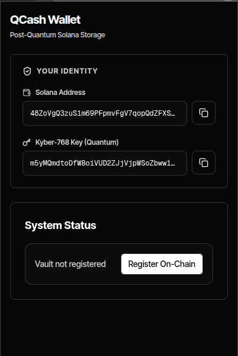
</p>

Then you will see something like this:
<p align="center">
  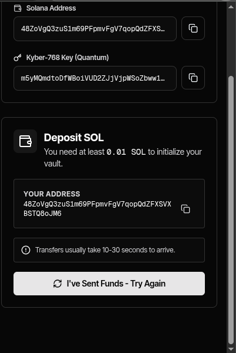
</p>

**Now deposit some SOL to your solana address.** After depositing, click on the `Register On Chain` button again.

**5) The actual screen**
<p align="center">
  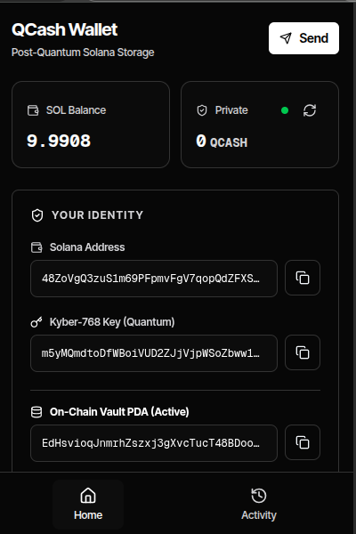
</p>

**6) Get QCash from Faucet**
Go to the faucet at: `http://localhost:5173/` and add your Vault PDA there to get some QCASH.
<p align="center">
  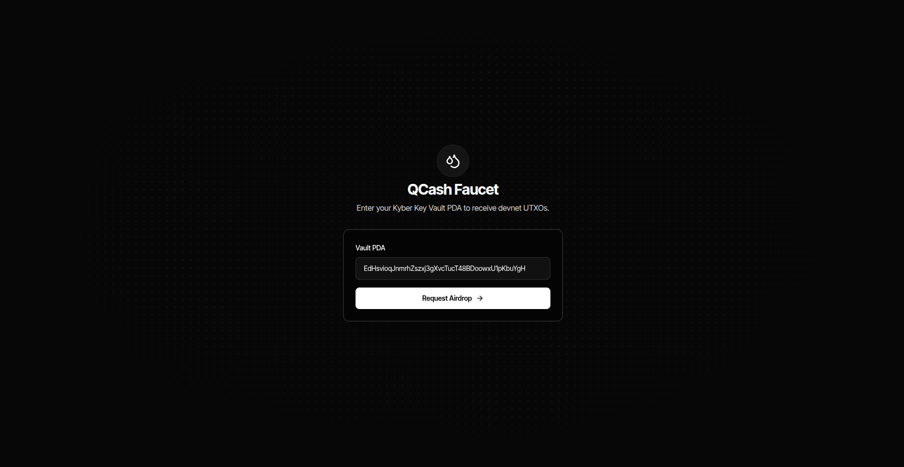
</p>
Click on the **Request Airdrop** button to get 100 QCASH.

**7) Sync Balance**
Come back to the extension and click on the **sync icon** on the top right corner to fetch the data on chain.
Now you got some Qcash!
<p align="center">
  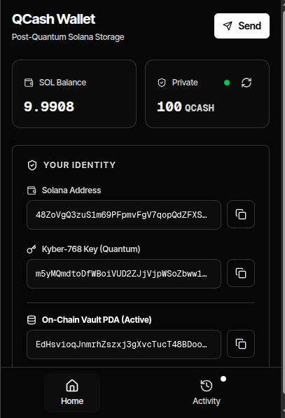
</p>

**8) Send QCash**
If want to send that to someone, you have to setup the same wallet in their extension or you can test this by creating a different profile in Chrome and loading it there.

Click on the **Send** button and add the receiver PDA address there.
<p align="center">
  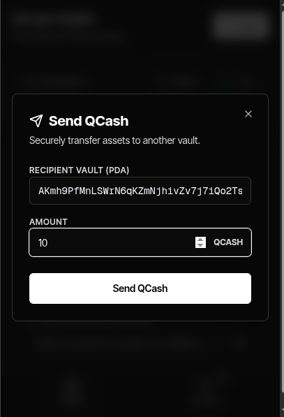
</p>

**9) Proof Generation**
Now you have to wait for some time. We are generating a **STARK proof** which is quantum safe.
You can inspect the extension to see what is happening (this way your wallet won't close).
<p align="center">
  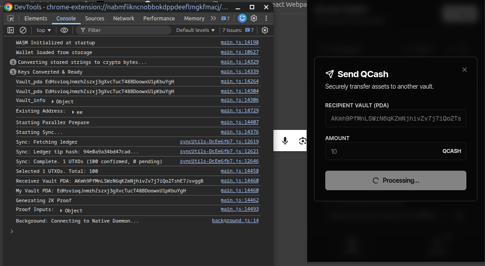
</p>

If you have a dedicated GPU, it will complete in seconds.

**10) Proof Ready**
After some time our proof is ready.
<p align="center">
  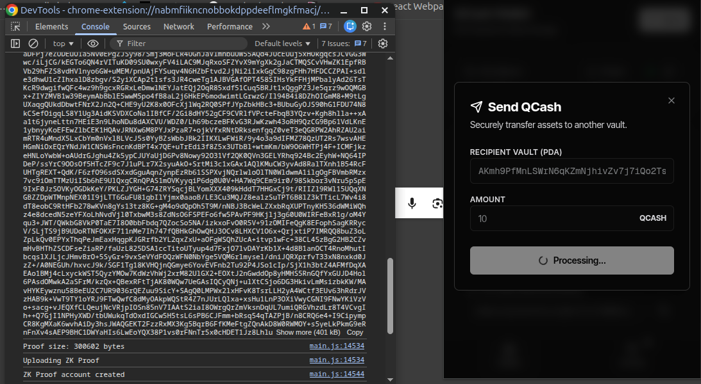
</p>

**11) Submission**
It uploads to the blockchain. You can see this in the logs as well.
<p align="center">
  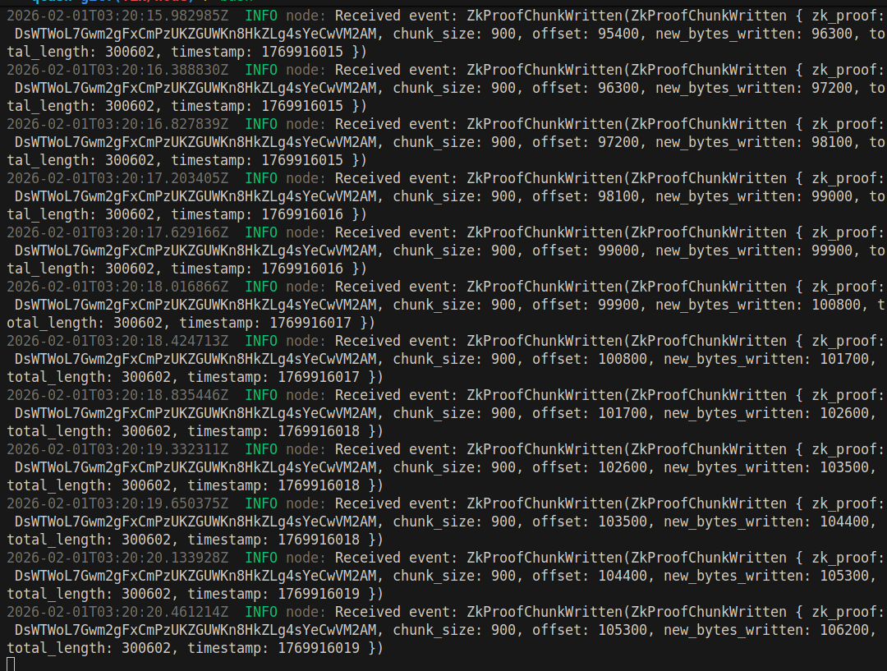
</p>

**12) Confirmation**
Now you can see the transaction on the blockchain.
<p align="center">
  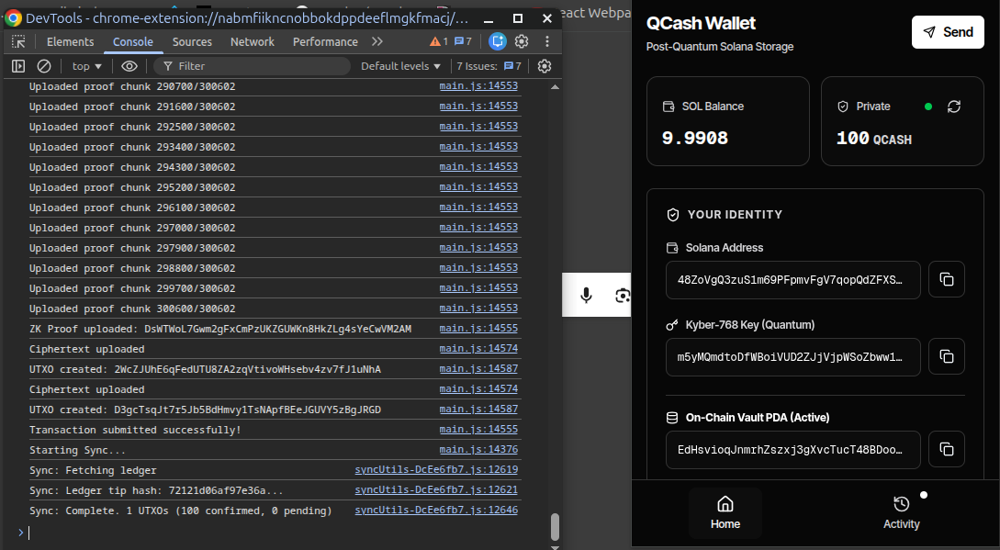
</p>

Now you gotta wait for nodes to verify the proof and update the state of the account.

**13) Now you see the balance updated**
<p align="center">
  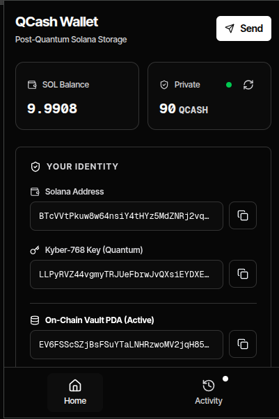
</p>
<p align="center">
  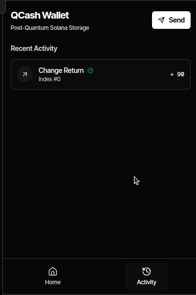
</p>
<p align="center">
  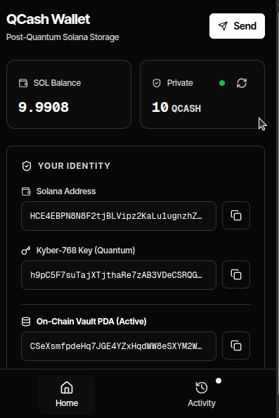
</p>
<p align="center">
  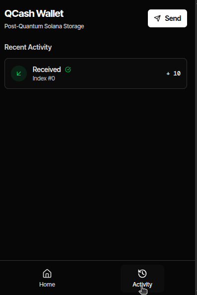
</p>

---

## License

This project is licensed under the Business Source License 1.1. See `LICENSE`.
